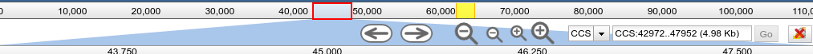

# ThemeComponent-RightAlignedControls

A JBrowse 'Theme Component' which aligns the zoom controls to the right.



# Usage

Add the following to your `trackList.json`. If you have an existing plugins section, you should add the plugin to that section.

```json
"plugins": [
	{
		"name": "ThemeComponent-RightAlignedControls",
		"location" : "https://cdn.rawgit.com/jbrowse-themes/ThemeComponent-RightAlignedControls/e4008f336b07d6c99983043dcdec7f57182ce4d3"
	}
]
```

# LICENSE

GPL-3.0
